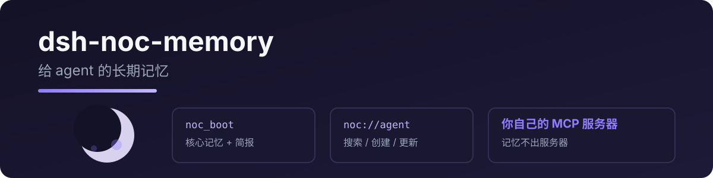

<p align="center">
  
</p>

# dsh-nocturne-memory

给 DeepSeek Harness 接上 **Nocturne Memory** 长期记忆:会话开始 boot 协议 + 记忆读写/搜索/更新,后端是你自己的 Nocturne MCP 服务器。

> 由 [pi-nocturne-memory](https://github.com/RealAlexandreAI/pi-nocturne-memory) 移植,协议与工具名完全一致。

[English](README.md) · [中文](README.zh.md)

## 工具

| 工具 | 说明 |
|---|---|
| `nocturne_boot` | 会话开始时加载:核心记忆 + 近期上下文 + 术语表 |
| `nocturne_read` | 按 URI 读记忆(`system://…`、`core://agent`…) |
| `nocturne_search` | 按关键词搜记忆(可加 domain 过滤) |
| `nocturne_create` | 新建记忆节点(支持 `[Baseline]/[Deviation]/[Result]/[Reusable judgment]`) |
| `nocturne_update` | patch(old_string/new_string)或 append 更新记忆 |

## 快速开始

```sh
dsh plugin add dsh-nocturne-memory
```

需要你能连到自己的 Nocturne MCP 服务器(项目见 [Nocturne Memory](https://github.com/martin22/Nocturne-Memory))。

```yaml
- id: memory
  name: dsh-nocturne-memory
  config:
    mcp_url: http://localhost:PORT/mcp
    mcp_auth_ref: NOCTURNE_MCP_AUTH   # 推荐:环境变量名
    # mcp_auth: <直接填 token>
```

| 键 | 必填 | 说明 |
|---|---|---|
| `mcp_url` | ✅ | 你的 Nocturne MCP 服务器地址 |
| `mcp_auth_ref` | * | MCP 认证 token 的环境变量名 |
| `mcp_auth` | * | 直接填 token(备用) |
| `protocol_version` | – | MCP 协议版本(默认 `2024-11-05`) |

\* 两个认证键填其一。

## 隐私

- 记忆存在**你自己的 MCP 服务器**,本插件是薄客户端,本地不落任何内容
- token 每次操作经 `ctx.credentials` 解析——不写日志
- 只把你要读/写的记忆 URI、查询、内容发给你的服务器

## 开发

```bash
npm install
npm run typecheck
npm test          # SSE 解析 / 文本提取
npm run build
```

真实 MCP 测试(复用你 pi 的 Nocturne 配置):

```bash
node --import tsx tests/real/real-mcp.mjs
```

## License

MIT
